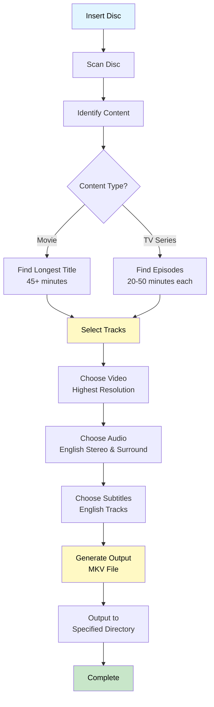
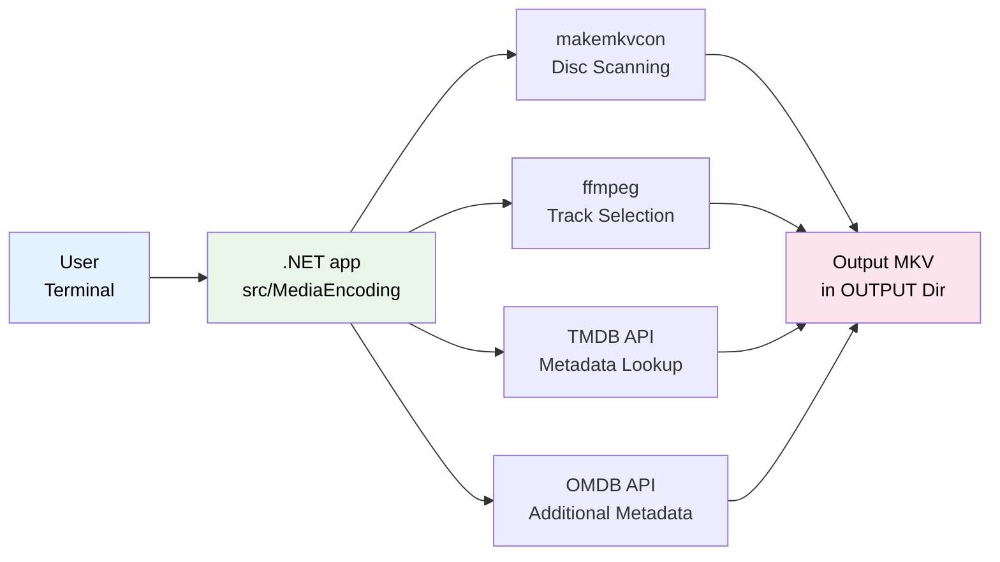
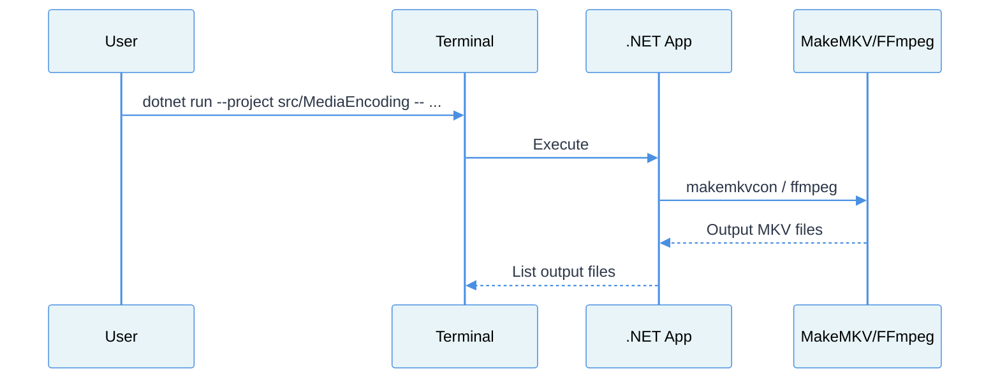

# media-encoding

Tools and scripts for ripping, encoding and organizing media files from DVDs, Blu-Ray, and Blu-Ray UltraHD discs.

## Quick Start

```bash
# 1) Ensure MakeMKV & FFmpeg are installed (see Requirements)

# 2) Install .NET SDK 10+
# Linux (via package manager) or from https://dotnet.microsoft.com/download

# 3) Run the app
dotnet run --project src/MediaEncoding -- --help

# Quick run examples
dotnet run --project src/MediaEncoding -- --mode movie --output ~/Movies --disc disc:0
dotnet run --project src/MediaEncoding -- --mode tv --output ~/TV --title "Breaking Bad" --season 1
```

### Content Mode

- Use `--mode movie` for feature film discs.
- Use `--mode tv` for TV season/episode discs.

### Environment Variables

**TMDB_API_KEY** (Optional but recommended)

For automatic online metadata lookup (movie titles, years, TV series info):

```bash
# Set your TMDB API key (get a free key at https://www.themoviedb.org/settings/api)
export TMDB_API_KEY="your_api_key_here"

# Then the app will automatically look up and name files correctly
dotnet run --project src/MediaEncoding -- --mode movie --title "inception" --output ~/Movies
# Output: Inception (2010).mkv (with correct capitalization and year)
```

**OMDB_API_KEY** (Optional)

For additional metadata lookup via the Open Movie Database:

```bash
# Set your OMDB API key (get a free key at https://www.omdbapi.com/apikey.aspx)
export OMDB_API_KEY="your_api_key_here"
```

To make environment variables permanent, add to your shell config (`~/.bashrc`, `~/.zshrc`, etc.):

```bash
export TMDB_API_KEY="your_tmdb_api_key_here"
export OMDB_API_KEY="your_omdb_api_key_here"
```

## Features

- **Automatic disc scanning** - Detects and analyzes all titles on the disc
- **Smart content detection** - Identifies main movie or TV episodes automatically
- **Online disc identification** - Uses MusicBrainz for disc ID lookup
- **Online metadata lookup** - Fetches movie and TV metadata from TMDB (The Movie Database)
- **Optimal quality** - Rips at the highest available resolution
- **Audio track selection** - Includes both stereo and surround sound audio when available
- **Subtitle support** - Automatically includes English subtitles if present
- **Intelligent file naming** - Uses online metadata for accurate naming
- **Batch processing** - Can process entire TV season discs at once

## Requirements

### Software Dependencies

1. **MakeMKV** - For disc ripping
   - Download from: https://www.makemkv.com/
   - Ubuntu/Debian: Follow instructions on MakeMKV website
   - macOS: Install via DMG from website

2. **FFmpeg** - For video analysis and re-encoding
   ```bash
   # Ubuntu/Debian
   sudo apt-get install ffmpeg
   
   # macOS
   brew install ffmpeg
   
   # Fedora
   sudo dnf install ffmpeg
   ```

3. **.NET SDK 10+** - For running the .NET app
   ```bash
   # Verify install
   dotnet --version
   # Run the app
   dotnet run --project src/MediaEncoding -- --help
   ```

4. **libdiscid** (Optional but recommended) - For disc ID calculation
   ```bash
   # Ubuntu/Debian
   sudo apt-get install libdiscid0 libdiscid-dev
   
   # After installing system library:
   pip install discid
   ```
   Enables MusicBrainz disc ID lookups for better metadata identification.

5. **API Keys** (Optional but recommended) - For online metadata lookup
   - **TMDB**: Sign up for a free account at [TMDB](https://www.themoviedb.org/signup), get your API key at [TMDB API Settings](https://www.themoviedb.org/settings/api)
   - **OMDB**: Sign up at [OMDB](https://www.omdbapi.com/apikey.aspx)
   - **Recommended:** Set them as environment variables:
      ```bash
      export TMDB_API_KEY="your_tmdb_api_key"
      export OMDB_API_KEY="your_omdb_api_key"
      ```
   - Alternative: Edit the app configuration file

6. **API Keys** (Optional but recommended) - For online metadata lookup
   - **TMDB**: Sign up for a free account at [TMDB](https://www.themoviedb.org/signup), get your API key at [TMDB API Settings](https://www.themoviedb.org/settings/api)
   - **OMDB**: Sign up at [OMDB](https://www.omdbapi.com/apikey.aspx)
   - **Recommended:** Set them as environment variables:
     ```bash
     export TMDB_API_KEY="your_tmdb_api_key"
     export OMDB_API_KEY="your_omdb_api_key"
     ```
   - Alternative: Add them to your `config.yaml` file (less secure)

### Hardware Requirements

- DVD or Blu-Ray drive
- Sufficient disk space (movies can be 5-50GB each)
- Adequate processing power for video encoding

## Installation

1. Clone this repository:
   ```bash
   git clone https://github.com/mapitman/media-encoding.git
   cd media-encoding
   ```

2. Build and restore the .NET app:
   ```bash
   dotnet restore src/MediaEncoding
   dotnet build src/MediaEncoding
   ```

3. (Optional) Create aliases for convenience:
   ```bash
   alias ripmovie='dotnet run --project src/MediaEncoding -- --mode movie'
   alias riptv='dotnet run --project src/MediaEncoding -- --mode tv'
   ```

4. Verify dependencies are installed:
   ```bash
   dotnet run --project src/MediaEncoding -- --help
   ```

### Notes

- Wrapper scripts now call the .NET app directly.
- Make-based Python virtualenv steps are no longer required.

## Usage

### Direct Usage

```bash
# Rip a movie (override output and pass extra args)
dotnet run --project src/MediaEncoding -- --mode movie --output ~/Movies --title "The Matrix" --year 1999

# Rip a TV season disc
dotnet run --project src/MediaEncoding -- --mode tv --output ~/TV --title "Breaking Bad" --season 1 --episode-start 1
```

### Ripping a Movie

Use `--mode movie` for movie discs:

```bash
dotnet run --project src/MediaEncoding -- --mode movie --title "Movie Title" --year 2024 --output /path/to/output
```

**Options:**
- `--mode movie|tv` - Content type (movie or TV series)
- `--disc DISC` - Disc path (default: `disc:0` for first drive)
- `--output DIR` - Output directory (required)
- `--temp DIR` - Temporary directory (default: `OUTPUT_DIR/.makemkv`)
- `--title TITLE` - Title for naming
- `--year YEAR` - Release year for naming
- `--disc-type TYPE` - Override disc type for size estimation (`dvd`, `bd`, `uhd`)

**Example:**
```bash
dotnet run --project src/MediaEncoding -- --mode movie --title "The Matrix" --year 1999 --output ~/Movies
```

This will:
1. Scan the disc and identify the main feature
2. Rip the main movie at highest resolution
3. Include English audio (stereo and surround)
4. Include English subtitles
5. Save as `~/Movies/The Matrix (1999).mkv`

### Ripping a TV Series

Use `--mode tv` for TV series discs:

```bash
dotnet run --project src/MediaEncoding -- --mode tv --title "Show Name" --season 1 --output /path/to/output
```

**Options:**
- `--mode tv` - Content type TV series
- `--disc DISC` - Disc path (default: `disc:0`)
- `--output DIR` - Output directory (required)
- `--temp DIR` - Temporary directory (default: `OUTPUT_DIR/.makemkv`)
- `--title TITLE` - TV series title for naming
- `--season NUM` - Season number (default: 1)
- `--disc-type TYPE` - Override disc type for size estimation (`dvd`, `bd`, `uhd`)

**Example:**
```bash
dotnet run --project src/MediaEncoding -- --mode tv --title "Breaking Bad" --season 1 --output ~/TV
```

This will:
1. Scan the disc and identify all episodes
2. Rip each episode at highest resolution
3. Include English audio and subtitles
4. Save as `~/TV/Breaking Bad - S01E01.mkv`, `~/TV/Breaking Bad - S01E02.mkv`, etc.

### Advanced Usage (.NET App)

For more control, use the .NET app directly:

```bash
dotnet run --project src/MediaEncoding -- --output /path/to/output [OPTIONS]
```

**Options:**
- `--mode movie|tv` - Content type (preferred)
- `--disc DISC` - Disc path (default: `disc:0`)
- `--output DIR` - Output directory (required)
- `--temp DIR` - Temporary directory
- `--tv` - Treat as TV series disc (deprecated; use `--mode tv`)
- `--title TITLE` - Title for naming
- `--year YEAR` - Year for naming
- `--season NUM` - Season number for TV series
- `--episode-start NUM` - Starting episode number for TV
- `--disc-type TYPE` - Override disc type for size estimation (`dvd`, `bd`, `uhd`)
- `--debug` - Enable debug logging

**Examples:**

Rip a movie with custom disc path:
```bash
dotnet run --project src/MediaEncoding -- --mode movie --disc /dev/sr0 --title "Inception" --year 2010 --output ~/Movies
```

Rip TV series episodes:
```bash
dotnet run --project src/MediaEncoding -- --mode tv --disc disc:0 --title "Friends" --season 1 --episode-start 1 --output ~/TV
```

Force DVD fallback for a TV special (more accurate size estimation when `CINFO:0` is missing):
```bash
dotnet run --project src/MediaEncoding -- --mode tv --output ~/TV --title "The Cat in the Hat" --year 1971 --disc-type dvd
```

**More Examples:** See [EXAMPLES.md](EXAMPLES.md) for comprehensive usage examples including 4K UHD, multiple drives, network storage, and more.

## How It Works

### Media Ripping Workflow

The script follows this workflow for both movies and TV series:



### Component Architecture

The ripping system integrates multiple tools and services:



### Running Flow

When you run the wrapper scripts, this is the flow:



## How It Works

### 1. Disc Scanning

The script uses `makemkvcon` to scan the disc and gather information about all titles, including:
- Duration
- Size
- Number of chapters
- Available audio and subtitle tracks

### 2. Content Identification

**For Movies:**
- Finds the longest title on the disc
- Must be at least 45 minutes long
- Typically this is the main feature film

**For TV Series:**
- Finds all titles between 20-50 minutes
- Sorts them in order
- Treats each as a separate episode

### 3. Track Selection

**Video:**
- Selects the highest resolution video stream
- Copies without re-encoding to preserve quality

**Audio:**
- Includes all English stereo (2 channel) tracks
- Includes all English surround sound (5.1+) tracks
- Copies without re-encoding to preserve quality

**Subtitles:**
- Includes all English subtitle tracks
- Preserves format (SRT, PGS, etc.)

### 4. File Naming

**Movies:** `Title (Year).mkv`
- Example: `The Matrix (1999).mkv`

**TV Series:** `Show Name - S##E##.mkv`
- Example: `Breaking Bad - S01E01.mkv`

## Configuration

### Configuration File

The app uses a YAML configuration file at [src/MediaEncoding/appsettings.yaml](src/MediaEncoding/appsettings.yaml). Edit it to set defaults:

```yaml
disc:
   default_path: "disc:0"
   default_temp_dir: "/tmp/makemkv"

output:
   movies_dir: "~/Movies"
   tv_dir: "~/TV"

encoding:
   include_english_subtitles: true
   include_stereo_audio: true
   include_surround_audio: true

metadata:
   lookup_enabled: true
```

Environment variables (e.g., `OMDB_API_KEY`, `TMDB_API_KEY`) override config values.

### Online Metadata Lookup

The script can automatically fetch movie and TV series metadata from OMDB (Open Movie Database) and TMDB (The Movie Database) to ensure accurate file naming and metadata. **OMDB is tried first; TMDB is used as a fallback if OMDB is unavailable.**

1. **Get API Keys:**
   
   **OMDB (Primary):**
   - Sign up at [https://www.omdbapi.com/apikey.aspx](https://www.omdbapi.com/apikey.aspx)
   - Choose a plan (free plan available)
   - Copy your API key
   
   **TMDB (Fallback):**
   - Sign up at [https://www.themoviedb.org/signup](https://www.themoviedb.org/signup)
   - Navigate to [API Settings](https://www.themoviedb.org/settings/api)
   - Request an API key (choose "Developer" option)
   - Copy your API key

2. **Configure the API Keys (Recommended Method - Environment Variables):**
   Set them as environment variables for better security:
   ```bash
   # Linux/macOS - Add to ~/.bashrc or ~/.zshrc for persistence
   export OMDB_API_KEY="your_omdb_api_key_here"
   export TMDB_API_KEY="your_tmdb_api_key_here"
   ```
   
   **Alternative Method - Config File (Less Secure):**
   Add them to your `config.yaml`:
   ```yaml
   metadata:
     lookup_enabled: true
     omdb_api_key: "your_omdb_api_key_here"
     tmdb_api_key: "your_tmdb_api_key_here"
   ```
   
   **Note:** Environment variables take precedence over config file values. Using environment variables is more secure as they won't be accidentally committed to version control.

3. **Features:**
   - **OMDB (Primary)**: Movie and TV metadata, IMDb ID lookups, ratings, alternative titles
   - **TMDB (Fallback)**: Automatic movie title and year lookup, TV series name and season information, enhanced metadata (genres, ratings, descriptions)
   - Accurate file naming based on official titles
   - Disc identification using MusicBrainz (when available)
   - **Lookup Order**: OMDB is queried first; if unavailable or no match found, TMDB is used as fallback

4. **Usage:**
   ```bash
   # The script will automatically look up metadata using available API keys
   ./rip_movie.sh --title "inception" --output ~/Movies
   # Output: Inception (2010).mkv (with correct capitalization and year)
   
   # For TV series
   ./rip_tv.sh --title "breaking bad" --season 1 --output ~/TV
   # Output: Breaking Bad - S01E01.mkv, Breaking Bad - S01E02.mkv, etc.
   ```

If metadata lookup is disabled or both services are unavailable, the script falls back to using the disc title.

### Temporary Directory

By default, files are ripped to `/tmp/makemkv` before being processed. You can change this with the `--temp` option if you need more space:

```bash
./rip_movie.sh --temp /mnt/large-disk/temp --output ~/Movies
```

### Disc Detection

The script defaults to `disc:0` which is typically the first optical drive. If you have multiple drives or want to specify a device directly:

```bash
# Use second drive
./rip_movie.sh --disc disc:1 --output ~/Movies

# Use specific device (Linux)
dotnet run --project src/MediaEncoding -- --disc /dev/sr0 --output ~/Movies

# Use specific device (macOS)
dotnet run --project src/MediaEncoding -- --disc /dev/disk2 --output ~/Movies
```

### Size Estimation

Pre-rip size estimation uses MakeMKV's reported sizes when available; otherwise it falls back to duration-based estimates with a disc-type-aware mux rate:
- DVD: ~1.1 MB/s
- Blu-ray: ~4.5 MB/s
- UHD/4K: ~6.5 MB/s

You can override detection with `--disc-type dvd|bd|uhd` in `rip_movie.sh` or `rip_tv.sh`. The progress bar will display a per-title estimate, which tends to be more accurate than the aggregate pre-rip estimate.
```

## Troubleshooting

### "Missing required tools" error

Make sure MakeMKV and FFmpeg are installed and in your PATH:
```bash
which makemkvcon
which ffmpeg
which ffprobe
```

### MakeMKV beta key required

MakeMKV requires a license or beta key. Get a free beta key from:
https://www.makemkv.com/forum/viewtopic.php?f=5&t=1053

### Disc not detected

1. Verify the disc is inserted and readable
2. Check disc path with: `makemkvcon info disc:0`
3. Try specifying the device directly: `--disc /dev/sr0`

### Insufficient disk space

Blu-Ray discs can be very large (25-50GB). Make sure you have enough space in both the temp and output directories.

### Permission denied errors

The script may need elevated permissions to access optical drives:
```bash
sudo ./rip_movie.sh --title "Movie" --output ~/Movies
```

## Advanced Features

### Metadata Lookup

The script supports online metadata lookup from OMDB (primary) and TMDB (fallback) APIs. **OMDB is queried first; TMDB is used if OMDB is unavailable or finds no match.**

**To enable:**

1. Get API keys:
   - OMDB (primary): https://www.omdbapi.com/apikey.aspx
   - TMDB (fallback): https://www.themoviedb.org/settings/api

2. Set environment variables:
   ```bash
   export OMDB_API_KEY="your_omdb_api_key"
   export TMDB_API_KEY="your_tmdb_api_key"
   ```

3. Or add to `config.yaml`:
   ```yaml
   metadata:
     lookup_enabled: true
     omdb_api_key: "your_omdb_api_key"
     tmdb_api_key: "your_tmdb_api_key"
   ```

### Custom Track Selection

To modify which audio/subtitle tracks are included, edit the `encode_file()` function in `rip_disc.py`. Current logic:

- **Audio**: Include all English stereo (2ch) and surround (6+ch) tracks
- **Subtitles**: Include all English subtitle tracks

### Batch Processing

To process multiple discs, create a simple loop:

```bash
#!/bin/bash
for disc in "Movie1:1999" "Movie2:2000" "Movie3:2001"; do
    title="${disc%:*}"
    year="${disc#*:}"
    echo "Insert disc for $title and press Enter..."
    read
    ./rip_movie.sh --title "$title" --year "$year" --output ~/Movies
    echo "Eject disc and press Enter to continue..."
    read
done
```

## File Formats

### Input

- DVD Video (VIDEO_TS)
- Blu-Ray (BDMV)
- UltraHD Blu-Ray (4K)

### Output

All output files are in MKV (Matroska) format:
- Container: MKV
- Video: Original codec (H.264, H.265, VC-1, etc.) - copied without re-encoding
- Audio: Original codec (AC3, DTS, TrueHD, etc.) - copied without re-encoding
- Subtitles: Original format (PGS, SRT, VobSub) - copied

## Performance

### Typical Processing Times

- **DVD ripping**: 10-30 minutes
- **Blu-Ray ripping**: 30-90 minutes
- **UltraHD Blu-Ray**: 60-180 minutes

Times vary based on:
- Disc read speed
- Disc size
- CPU performance (though copying is fast)
- Disk I/O speed

### Disk Space Requirements

- **DVD**: 4-8 GB per movie
- **Blu-Ray**: 15-35 GB per movie
- **UltraHD Blu-Ray**: 40-100 GB per movie

## License

This project is provided as-is for personal use. Please ensure you own the physical media you are ripping and comply with your local copyright laws.

## Contributing

Contributions are welcome! Please feel free to submit issues or pull requests.

## Support

For issues or questions:
1. Check the Troubleshooting section above
2. Open an issue on GitHub
3. Consult the MakeMKV forums: https://www.makemkv.com/forum/

## Acknowledgments

- **MakeMKV** - For the excellent disc ripping functionality
- **FFmpeg** - For comprehensive media processing capabilities
