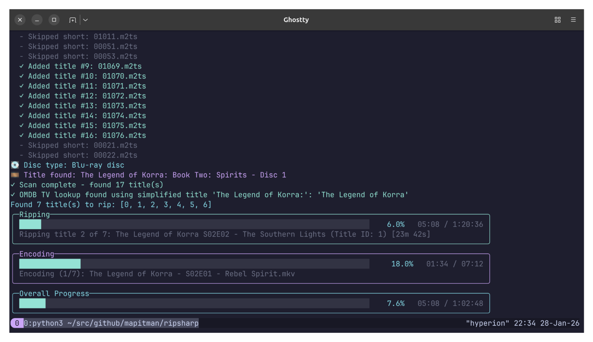

# RipSharp

**RipSharp** is a command-line tool for automated optical disc ripping and file naming. It integrates MakeMKV for disc extraction with TMDB, OMDB, and TVDB metadata providers to generate properly organized video files with correct naming and metadata for movies and TV shows. Extracted tracks are re-encoded with FFmpeg using H.264 (slow, CRF 22) for video and AAC for audio, with optional English subtitle embedding.



## Features

- **Automatic disc detection** — Identifies DVD, Blu-ray, and UHD discs
- **MakeMKV integration** — Extracts titles without quality loss
- **Multi-provider metadata** — Fetches movie/TV info from TMDB, OMDB, and TVDB
- **TV episode resolution** — Looks up episode titles for proper naming
- **H.264 re-encoding** — Compresses video with FFmpeg (CRF 22, slow preset)
- **Audio handling** — Copies AAC/AC3/EAC3, transcodes others to AAC
- **English filtering** — Selects English audio tracks and optional subtitles
- **Smart file naming** — Generates organized filenames with metadata
- **Progress tracking** — Real-time display for scanning, ripping, and encoding

## Requirements

### Software

- **MakeMKV** – [makemkv.com](https://www.makemkv.com/)
- **FFmpeg** – See installation options below
- **.NET SDK 10.0+** – [dotnet.microsoft.com/download](https://dotnet.microsoft.com/download)

### API Keys (Optional)

- **TMDB** – [themoviedb.org/settings/api](https://www.themoviedb.org/settings/api) (free)
- **OMDB** – [omdbapi.com/apikey.aspx](https://www.omdbapi.com/apikey.aspx) (free tier)
- **TVDB** – [thetvdb.com/dashboard/account/apikeys](https://thetvdb.com/dashboard/account/apikeys) (free)

### Hardware

- Optical disc drive (DVD/Blu-ray/UHD) or ISO file
- 5–100 GB free disk space per disc

## Quick Start

1. **Install dependencies**
   
   Install MakeMKV from https://www.makemkv.com/

   Install FFmpeg (choose one):

   Ubuntu/Debian:

   ```bash
   sudo apt install ffmpeg
   ```

   Fedora:

   ```bash
   sudo dnf install ffmpeg
   ```

   Arch:

   ```bash
   sudo pacman -S ffmpeg
   ```

   openSUSE:

   ```bash
   sudo zypper install ffmpeg
   ```

   Alpine:

   ```bash
   sudo apk add ffmpeg
   ```

   macOS (Homebrew):

   ```bash
   brew install ffmpeg
   ```

   Windows (winget):

   ```bash
   winget install --id Gyan.FFmpeg
   ```

   Install .NET SDK 10.0+ from https://dotnet.microsoft.com/download

2. **Clone and build**
   
   ```bash
   git clone https://github.com/mapitman/ripsharp.git
   cd ripsharp
   dotnet build src/RipSharp
   ```

3. **Set API keys** (optional but recommended)
   
   ```bash
   export TMDB_API_KEY="your_key_here"
   export OMDB_API_KEY="your_key_here"
   export TVDB_API_KEY="your_key_here"
   ```

4. **Rip a disc**
   
   ```bash
   # Movie from physical disc (auto-detected)
   dotnet run --project src/RipSharp -- --output ~/Movies
   
   # TV series with episode titles
   dotnet run --project src/RipSharp -- --output ~/TV --mode tv --title "Breaking Bad" --season 1
   
   # From ISO file
   dotnet run --project src/RipSharp -- --output ~/Movies --disc "file:/path/to/movie.iso"
   ```

## Options

### Required

| Option          | Description                         |
|:----------------|:------------------------------------|
| `--output PATH` | Output directory for ripped files   |

### Optional

| Option                   | Description                                                                                           |
|:-------------------------|:------------------------------------------------------------------------------------------------------|
| `--mode auto\|movie\|tv` | Content type detection (default: `auto`)                                                              |
| `--disc PATH`            | Optical drive or ISO file path (default: `disc:0`, e.g., `disc:1`, `/dev/sr0`, `file:movie.iso`)      |
| `--temp PATH`            | Temporary directory (default: auto-generated in output)                                               |
| `--title TEXT`           | Custom title for file naming                                                                          |
| `--year YYYY`            | Release year (movies only)                                                                            |
| `--season N`             | Season number (TV only, default: `1`)                                                                 |
| `--episode-start N`      | Starting episode number (TV only, default: `1`)                                                       |
| `--disc-type TYPE`       | Override disc type: `dvd\|bd\|uhd` (auto-detect by default)                                           |
| `--sequential`           | Disable parallel processing (rip all, then encode all)                                                |
| `--debug`                | Enable debug logging                                                                                  |
| `-h, --help`             | Show help message                                                                                     |

### Environment Variables

| Variable        | Description                                    |
|:----------------|:-----------------------------------------------|
| `TMDB_API_KEY`  | TMDB API key for metadata lookup (recommended) |
| `OMDB_API_KEY`  | OMDB API key for metadata lookup (optional)    |
| `TVDB_API_KEY`  | TVDB API key for TV episode titles (optional)  |

## Building

```bash
git clone https://github.com/mapitman/ripsharp.git
cd ripsharp
dotnet restore src/RipSharp
dotnet build src/RipSharp
```

To run without building separately:

```bash
dotnet run --project src/RipSharp -- --output ~/Movies
```

## Examples

### Movie with Custom Title

```bash
dotnet run --project src/RipSharp -- --output ~/Movies --title "The Matrix" --year 1999
```

**Output:** `~/Movies/The Matrix (1999).mkv`

### TV Series Season

```bash
dotnet run --project src/RipSharp -- --output ~/TV --mode tv --title "Breaking Bad" --season 1
```

**Output:** `~/TV/Breaking Bad - S01E01 - Pilot.mkv`, `~/TV/Breaking Bad - S01E02 - Cat's in the Bag....mkv`, etc.

### Using Alternate Disc Drive

```bash
dotnet run --project src/RipSharp -- --output ~/Movies --disc disc:1
```

### Ripping from ISO File

```bash
dotnet run --project src/RipSharp -- --output ~/Movies --disc "file:/path/to/movie.iso"
```

**Output:** Processes the ISO file instead of a physical disc

See [EXAMPLES.md](EXAMPLES.md) for more detailed examples.

## File Naming

RipSharp automatically generates organized filenames based on metadata lookup results.

### Movies

Format: `Title (Year).mkv`

Examples:
- `The Matrix (1999).mkv`
- `Inception (2010).mkv`
- `The Shawshank Redemption (1994).mkv`

### TV Series

Format: `Show Name - S##E## - Episode Title.mkv`

Examples:
- `Breaking Bad - S01E01 - Pilot.mkv`
- `The Legend of Korra - S01E01 - Welcome to Republic City.mkv`
- `Game of Thrones - S03E09 - The Rains of Castamere.mkv`

**Note:** Episode titles require a TVDB API key. Without it, files are named `Show Name - S##E##.mkv`.

## How It Works

RipSharp follows a streamlined workflow to automatically process optical discs:

1. **Scan** — Uses MakeMKV to detect all titles on the disc
2. **Detect** — Analyzes title durations to identify content type (movie vs TV series)
3. **Lookup** — Queries metadata providers (TMDB, OMDB, TVDB) for titles and episode information
4. **Rip** — Extracts titles using MakeMKV at highest quality
5. **Encode** — Re-encodes with FFmpeg (H.264, AAC) with parallel processing for efficiency
6. **Rename** — Generates organized filenames and moves to output directory
7. **Cleanup** — Removes temporary files automatically

## Troubleshooting

### "Missing required tools" error

Ensure all dependencies are installed and in PATH:

```bash
which makemkvcon ffmpeg ffprobe dotnet
```

### Disc not detected

1. Insert disc and wait for it to be recognized by the system
2. Check if readable: `makemkvcon info disc:0`
3. Try alternate device: `--disc disc:1` or specify device path

### Insufficient disk space

Space requirements by disc type:
- DVD: 4–8 GB
- Blu-ray: 15–35 GB
- UHD 4K: 40–100 GB

Ensure both `--temp` and `--output` directories have sufficient space.

### MakeMKV beta key required

MakeMKV requires a license key. Get the latest beta key from: https://www.makemkv.com/forum/viewtopic.php?f=5&t=1053

### Permission denied

Some systems require elevated permissions to access optical drives:

```bash
sudo dotnet run --project src/RipSharp -- --output ~/Movies
```

## Support

- Check [Troubleshooting](#troubleshooting) for common issues
- Open an issue on GitHub: https://github.com/mapitman/ripsharp/issues
- See examples in [EXAMPLES.md](EXAMPLES.md)
- MakeMKV forums can help with drive or ripping issues: https://www.makemkv.com/forum/

## Performance

Typical ripping and encoding times vary by disc type, drive speed, and system performance.

| Disc Type | Size      | Approximate Time |
|:----------|:----------|:-----------------|
| DVD       | 4–8 GB    | 10–30 minutes    |
| Blu-ray   | 15–35 GB  | 30–90 minutes    |
| UHD 4K    | 40–100 GB | 60–180 minutes   |

**Factors affecting performance:**
- Optical drive read speed
- CPU encoding performance
- Disc condition and read errors
- Parallel processing enabled (default)

**Note:** Times include both ripping and encoding. Use `--sequential` to disable parallel processing if needed.

## Contributing

Contributions are welcome! See [CONTRIBUTING.md](CONTRIBUTING.md) for guidelines.

## License

MIT License - see [LICENSE](LICENSE) for details.

**Note:** Ensure you own the physical media and comply with applicable copyright laws when ripping discs.

## Acknowledgments

RipSharp is built on top of these excellent tools:

- **[MakeMKV](https://www.makemkv.com/)** — Disc ripping and extraction engine
- **[FFmpeg](https://ffmpeg.org/)** — Media encoding and processing
- **[TMDB](https://www.themoviedb.org/)** — Movie and TV series metadata
- **[OMDB](https://www.omdbapi.com/)** — Additional movie database
- **[TVDB](https://thetvdb.com/)** — TV episode information